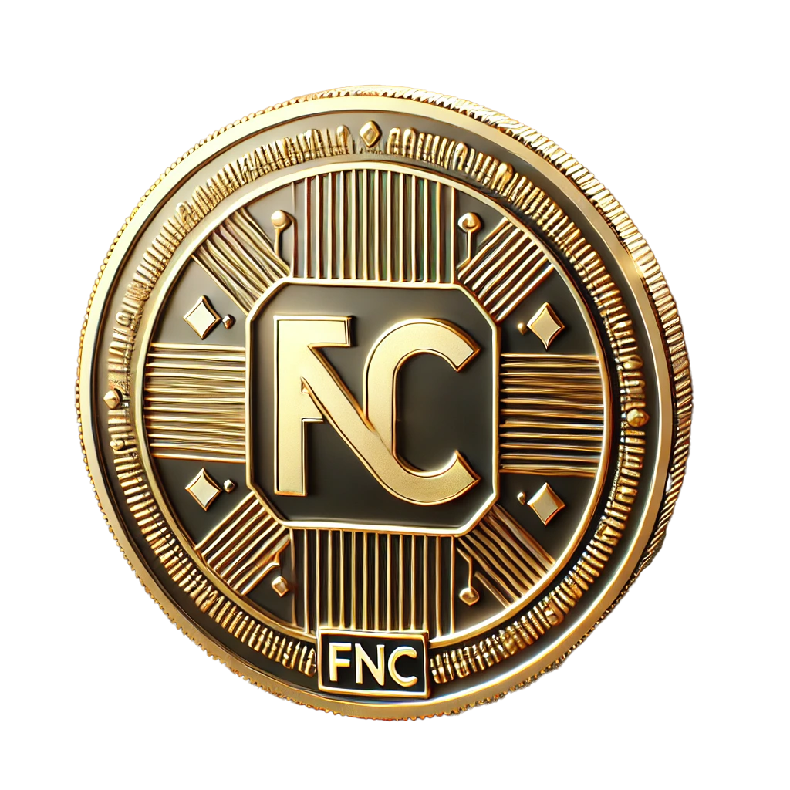

# FNC Ecosystem Token

---
FNC is the native token of a decentralized ecosystem for betting, casino, and mini-games. The ecosystem integrates smart contracts with Gnosis Safe multisignature wallets to ensure secure governance and transactions. FNC's tokenomics is designed to facilitate seamless operations within the ecosystem, providing users with a secure and efficient token for various activities.

---


---
# Project structure
```
├── 📁 broadcast                    [Standard Forge folder for transaction broadcasting]
├── 📁 graph                        [Files for running graphs related to FNC ecosystem]
├── 📁 hardhat                      [Alternative Hardhat code for deploying contracts]
├── 📁 pyScripts                    [Python scripts for additional functionality and testing]
├── 📁 scripts
│ ├── 📁 configs                    [Configuration scripts for deployment]
│ ├── 📁 deployments                [Deployment scripts for FNCToken and Gnosis Safe setup]
│ │ ├── 📄 DeployFNCToken.s.sol     [Script for deploying the FNCToken contract]
│ │ ├── 📄 DeploySafe.s.sol         [Script for deploying Gnosis Safe singleton]
│ │ ├── 📄 DeploySafeFactory.s.sol  [Script for deploying Gnosis Safe Proxy Factory]
│ │ └── 📄 DeploySafeProxy.s.sol    [Script for deploying SafeProxy with custom owners]
│ ├── 📁 interactions               [Scripts for interacting with deployed contracts]
│ ├── 📁 upgrades                   [Scripts for upgrading deployed contracts]
│ └── 📁 utils                      [Utility scripts, e.g., for encoding/decoding addresses]
│   ├── 📄 EncodeDecode.s.sol       [Library for encoding/decoding JSON-like data]
│   └── 📄 Format.s.sol             [Library for parsing and formatting data]
├── 📁 src
│ ├── 📄 FNCToken.sol               [FNC ERC20 token contract with minting and role management]
│ ├── 📄 FNCStacking.sol            [Contract for staking FNC tokens]
│ └── 📄 FNCAirdrop.sol             [Contract for conducting FNC airdrops]
├── 📁 test
│ ├── 📁 integration                [Integration tests for end-to-end functionality]
│ ├── 📁 mock                       [Mock contracts for external dependencies]
│ └── 📁 unit                       [Unit tests for individual functions and components]
│   └── 📄 FNCTokenTest.t.sol       [Tests for FNCToken functionality]
├── 📄 .env                         [Environment variables for deployment and testing]
├── 📄 foundry.toml                 [Forge configuration file]
├── 📄 Makefile                     [Makefile for automating build, deployment, and tests]
└── 📄 README.md                    [Project documentation, including usage instructions]
```

---
# with MAKE
See available commands:
```shell
make help
```

---

[Forge and Foundry](https://github.com/foundry-rs/foundry) (smart contract development toolchain)
[Book](https://book.getfoundry.sh/)
[Install](https://book.getfoundry.sh/getting-started/installation)

Install library
```shell
make install
```

Compile contracts
```shell
forge compile
```


Clean the repo
```shell
forge clean
```

Update Dependencies
```shell
forge update
```

Create snapshot (for gas consumption)
```shell
forge snapshot
```

Run tests
```shell
forge test
forge test -vv
forge coverage --ir-minimum
forge test --fork-url $AMOY_RPC_URL
forge test --match-test testGrantMinterRoleTokens
```
---
# Deploying
При развертывании контракта на сети, возможно, некоторые из необходимых контрактов (например, Gnosis Safe Factory, Safe Singleton, и Safe Proxy) уже развернуты в нужной сети. В этом случае можно использовать их адреса. Если они не развернуты, можно сделать это с помощью скриптов.

1. Проверка существующих развертываний
   Перед развертыванием проверьте, есть ли уже контракты на вашей целевой сети:

Safe Factory
Safe Singleton
Safe Proxy
Вы можете получить эти адреса через блокчейн-эксплореры или документацию сети.

2. Развертывание Gnosis Safe контрактов
   Если контракты не развернуты, используйте следующие команды для их развертывания:

### Deploy Gnosis Safe Factory:
```shell
make deploy-safe-factory NETWORK=amoy
```
### Deploy Gnosis Safe Singleton:
```shell
make deploy-safe NETWORK=amoy
```
### Deploy Gnosis Safe Proxy:
```shell
make deploy-safe-proxy NETWORK=amoy SAFE_FACTORY_ADDRESS=<SafeFactoryAddress> SAFE_SINGLETON_ADDRESS=<SafeSingletonAddress> JSON_ADDRESSES='["<Admin1>", "<Admin2>", "<Admin3>"]' REQUIRED_CONFIRMATIONS=2
```
### Deploy FNCToken:
```shell
make deploy-token NETWORK=amoy TOKEN_NAME=FNCToken TOKEN_SYMBOL=FNC TOKEN_SUPPLY=1000000000000000000000000000 SAFE=<SafeProxyAddress>
```

---
# Useful Links:
- [Forge Documentation](https://book.getfoundry.sh/)
- [Gnosis Safe Documentation](https://gnosis-safe.io/)
- [OpenZeppelin Contracts](https://docs.openzeppelin.com/contracts/4.x/)

---
# Startup example
```
1) Install library
    - make install
2) Deployment and configurationbase cotracts
    - make deploy-pipeline NETWORK=mumbai
```
---
# Environment Variables (.env)

- URLs for the RPC endpoints
POLYGON_RPC_URL=
AMOY_RPC_URL=
- Private key of the account that will be used for deployment
DEPLOYER_PRIVATE_KEY=
- API key for the Scan service
POLYGON_SCAN_API_KEY=
- Chain IDs for different networks
DEFAULT_CHAIN_ID=80001
POLYGON_CHAIN_ID=137
AMOY_CHAIN_ID=80002
TEST_CHAIN_ID=31337
- Addresses for the different accounts
ZERO_ADDRESS=
DUMMY_ADDRESS=
OWNER_ADDRESS=
ADMIN_FIRST_ADDRESS=
ADMIN_SECOND_ADDRESS=
ADMIN_THIRD_ADDRESS=
- Token configuration
TOKEN_NAME=FNCToken
TOKEN_SYMBOL=FNC
TOKEN_SUPPLY=1000000000000000000000000000
- Gnosis configuration
GNOSIS_SAFE_FACTORY_AMOY=0xd9Db270c1B5E3Bd161E8c8503c55ceABe70955c2
GNOSIS_SAFE_FACTORY_MATIC=0xEBF541Ad42f8d4D523D91316E7E391714A6ce489


docker
```
docker build -t fncdev/foundry-blockchain:dev .
docker push fncdev/foundry-blockchain:dev

docker rm $(docker ps -a -q)
docker rmi $(docker images -f "dangling=true" -q)
```

изменить git доступы

